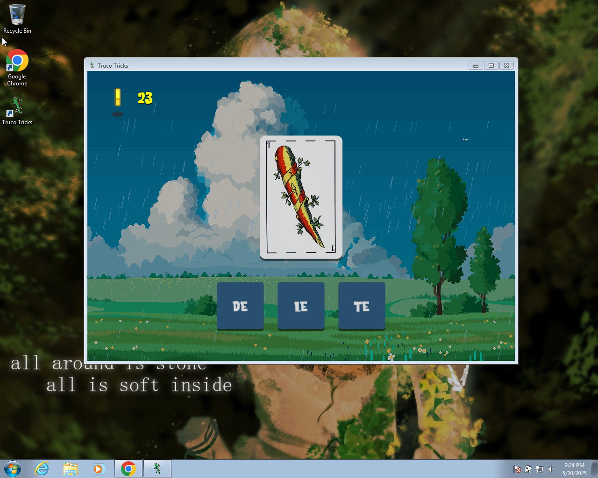

# Truco tricks



## Installing dependencies (glfw-x11/glfw-wayland depending on your display server)
```sh
$ sudo pacman -S --needed mingw-w64-gcc wine git base-devel glfw-x11 sdl2 sdl2_mixer premake wget sed make
$ wget https://files.jrsoftware.org/is/6/innosetup-6.4.3.exe
$ wine innosetup-6.4.3.exe
$ git clone --depth 1 https://github.com/memononen/nanovg.git
$ cd nanovg
$ wget -O premake5.lua https://raw.githubusercontent.com/alpheratz0/trucotricks/refs/heads/master/extra/nanovg_premake5.lua
$ mv nanovg_premake5.lua premake5.lua
$ premake5 gmake
$ make -C build
$ sudo install -m 644 build/libnanovg.a /usr/lib/
$ sudo install -d /usr/include/nanovg
$ sudo install -m 644 src/*.h /usr/include/nanovg/
```

## Building

Building is only supported from a linux host, but it still can be cross-compiled to windows using mingw.

### Windows (cross-compile)
```sh
$ make TARGET=windows distribute
$ cd trucotricks-windows-$(cat VERSION)
$ WINEPREFIX=~/.wine winecfg # add opengl32.dll to the list of libraries overrides
$ wine ./trucotricks.exe
```

### Linux
```sh
$ make
$ ./trucotricks
```

## Windows Installer (requires innosetup installed on wine)
```sh
$ make TARGET=windows installer
$ wine ./trucotricks-windows-$(cat VERSION)-setup.exe
```

## Sources

### NanoVG
```sh
$ git clone https://github.com/memononen/nanovg # took headers from here also
$ cd nanovg/src
$ x86_64-w64-mingw32-gcc -O2 -Wall -fPIC -I. -c nanovg.c
$ x86_64-w64-mingw32-gcc -shared -o libnanovg.dll nanovg.o -Wl,--out-implib,libnanovg.a -lopengl32 -lgdi32
```

### opengl32.dll (MesaForWindows)
Downloaded from [here](https://downloads.fdossena.com/geth.php?r=mesa64-latest)

### GLES3 headers (from Angle)
Downloaded from [here](https://chromium.googlesource.com/angle/angle.git)

### GLFW (version 3.4)
Downloaded from [here](https://github.com/glfw/glfw/releases/download/3.4/glfw-3.4.bin.WIN64.zip)

### SDL2 (version 2.32.4)
Downloaded from [here](https://github.com/libsdl-org/SDL/releases/download/release-2.32.4/SDL2-devel-2.32.4-mingw.tar.gz)

### SDL2_mixer (version 2.8.1)
Downloaded from [here](https://github.com/libsdl-org/SDL_mixer/releases/download/release-2.8.1/SDL2_mixer-devel-2.8.1-mingw.tar.gz)

## Licence
Code is licensed under GNU's General Public Licence v2. See COPYING for details.\
Assets are stolen from I dont know :(, I will investigate from where I took them.\
Also should include the licences of the libraries I used :(
